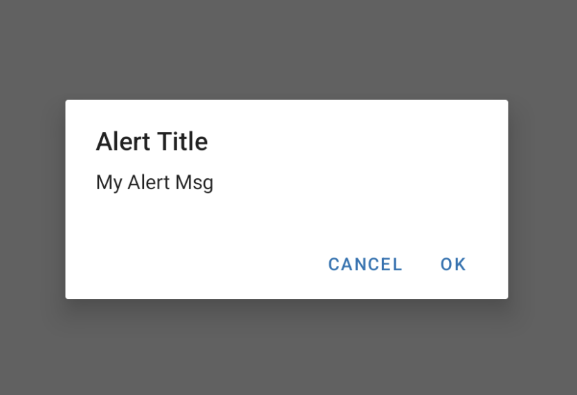

## Sử dụng Alert để confirm nội dung

```jsx
import {  Alert } from 'react-native'

Alert.alert('Tiêu đề', 'Nội dung', [
      {
        text: 'Cancel',
        onPress: () => console.log('Cancel Pressed'),
        style: 'cancel',
      },
      { text: 'OK', onPress: () => console.log('OK Pressed') },
    ]);
```

