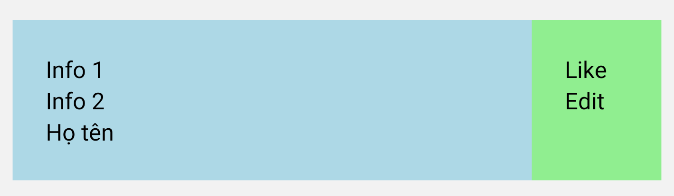
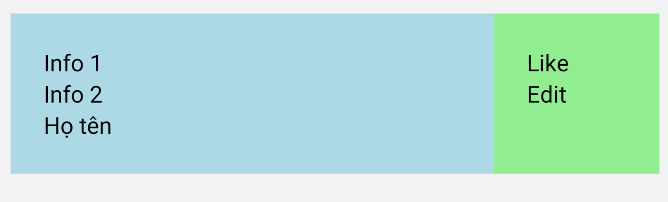
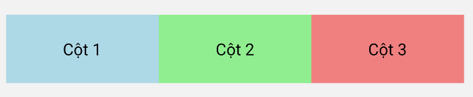
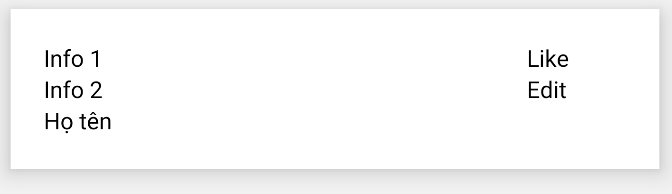
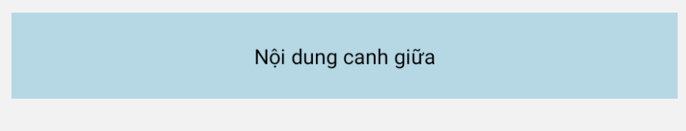
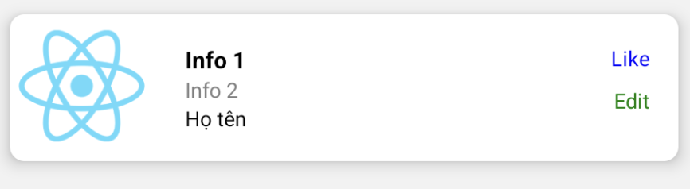
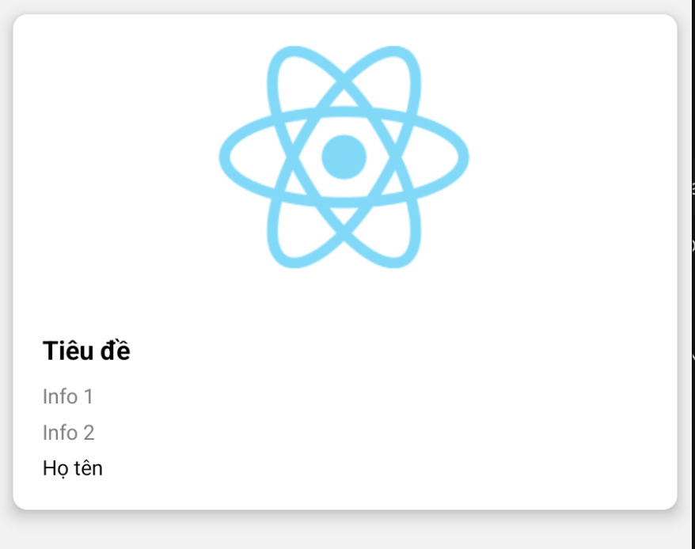

### Item đơn giản
Sử dụng % để định dạng cột 
```jsx
<View style={{ margin: 10 }}>
        <View style={{ flexDirection: 'row', width: "100%", backgroundColor: 'white' }}>
          <View style={{ backgroundColor: "lightblue", width: "80%", padding: 20 }}>
            <Text>Info 1</Text>
            <Text>Info 2</Text>
            <Text>Họ tên</Text>
          </View>
          <View style={{ backgroundColor: "lightgreen", width: "20%", padding: 20 }}>
            <Text>Like</Text>
            <Text>Edit</Text>
          </View>
        </View>
      </View>
```




Sử dụng **justifyContent: 'space-between'** để định dạng tự động
```jsx
<View style={{ margin: 10 }}>
        <View style={{ flexDirection: 'row', width: "100%", backgroundColor: 'white', justifyContent: 'space-between' }}>
          <View style={{ backgroundColor: "lightblue", flex: 1, padding: 20 }}>
            <Text>Info 1</Text>
            <Text>Info 2</Text>
            <Text>Họ tên</Text>
          </View>
          <View style={{ backgroundColor: "lightgreen", padding: 20, minWidth: 100 }}>
            <Text>Like</Text>
            <Text>Edit</Text>
          </View></View>
      </View>
```





### Item có 3 cột đều nhau, sử dụng flex
Sử dụng flex để tự động chia đều

Nếu muốn có thêm item thì copy thêm 1 cột,
ngược lại nếu muốn chia đều thì xoá bớt 1 cột
```jsx
<View style={{ margin: 10 }}>
        <View style={{
          flexDirection: 'row',
          width: "100%",
          backgroundColor: 'white'
        }}>
          <View style={{
            backgroundColor: "lightblue",
            flex: 1,
            padding: 20,
            alignItems: 'center'
          }}>
            <Text>Cột 1</Text>
          </View>

          <View style={{
            backgroundColor: "lightgreen",
            flex: 1,
            padding: 20,
            alignItems: 'center'
          }}>
            <Text>Cột 2</Text>

          </View>

          <View style={{
            backgroundColor: "lightcoral",
            flex: 1,
            padding: 20,
            alignItems: 'center'
          }}>
            <Text>Cột 3</Text>
          </View>

        </View>
      </View>
```




## Item có box shadow

```jsx
<View style={{ margin: 10, }}>
        <View style={{
          flexDirection: 'row', width: "100%", backgroundColor: 'white', justifyContent: 'space-between', shadowColor: "#000",
          shadowOffset: {
            width: 0,
            height: 4,
          },
          shadowOpacity: 0.30,
          shadowRadius: 4.65,

          elevation: 8,
        }}>
          <View style={{ flex: 1, padding: 20 }}>
            <Text>Info 1</Text>
            <Text>Info 2</Text>
            <Text>Họ tên</Text>
          </View>
          <View style={{ padding: 20, minWidth: 100 }}>
            <Text>Like</Text>
            <Text>Edit</Text>
          </View></View>
      </View>
```



## Thuộc tính canh giữa
dùng justifyContent và alignItems
```jsx
<View style={{ margin: 10 }}>
        <View style={{ backgroundColor: "lightblue", padding: 20, justifyContent: 'center', alignItems: 'center' }}>
          <Text>Nội dung canh giữa</Text>
        </View>
      </View>
```


### Mẫu dạng card có hình ảnh
```jsx
 <View style={{ margin: 10 }}>
        <View style={{
          flexDirection: 'row',
          width: "100%",
          backgroundColor: 'white',
          justifyContent: 'space-between',
          shadowColor: "#000",
          shadowOffset: { width: 0, height: 4 },
          shadowOpacity: 0.30,
          shadowRadius: 4.65,
          elevation: 8,
          borderRadius: 10, 
        }}>
          <Image
            source={require('@/assets/images/react-logo.png')}
            style={{ width: 100, height: 100 }}
          />
          <View style={{ flex: 1, padding: 20 }}>
            <Text style={{ fontSize: 16, fontWeight: 'bold' }}>Info 1</Text>
            <Text style={{ fontSize: 14, color: 'gray' }}>Info 2</Text>
            <Text style={{ fontSize: 14 }}>Họ tên</Text>
          </View>
          <View style={{ padding: 20, minWidth: 100, alignItems: 'flex-end' }}>
            <Text style={{ color: 'blue', marginBottom: 10 }}>Like</Text>
            <Text style={{ color: 'green' }}>Edit</Text>
          </View>
        </View>
      </View>
```



```jsx
<View style={{
        margin: 10,
        backgroundColor: 'white',
        borderRadius: 10,
        shadowColor: "#000",
        shadowOffset: { width: 0, height: 4 },
        shadowOpacity: 0.3,
        shadowRadius: 4.65,
        elevation: 8,
        overflow: 'hidden'
      }}>
        <Image
          source={require('@/assets/images/react-logo.png')}
          style={{ width: '100%', height: 200 }}
          resizeMode='contain'
        />

        <View style={{ padding: 20 }}>
          <Text style={{ fontSize: 18, fontWeight: 'bold', marginBottom: 10 }}>Tiêu đề</Text>
          <Text style={{ fontSize: 14, color: 'gray', marginBottom: 5 }}>Info 1</Text>
          <Text style={{ fontSize: 14, color: 'gray', marginBottom: 5 }}>Info 2</Text>
          <Text style={{ fontSize: 14 }}>Họ tên</Text>
        </View>
      </View>
```


