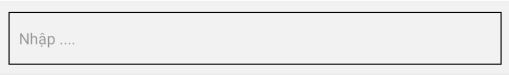
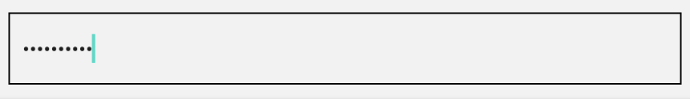

## Sử dụng Input trong react native

```jsx
import React, { useState } from 'react'
import {TextInput } from 'react-native'


const [name, setName] = useState("")

<TextInput
  style={{ borderWidth: 1, padding: 10, margin: 10 }}
  placeholder='Nhập ....' // in hướng dẫn 
  value={name} // giá trị của input
  onChangeText={(t) => { // biến t là input người dùng nhập
    setName(t)
  }}
/>
```




### Ẩn password
sử dụng secureTextEntry={true}
```jsx
<TextInput secureTextEntry={true} />
```



### Một số thuộc tính style của TextInput

```jsx
  borderColor: 'red',
  borderRadius: 20,
  borderStyle:'dashed'|'dotted'|'solid',
  backgroundColor: 'red',
  ...
```


